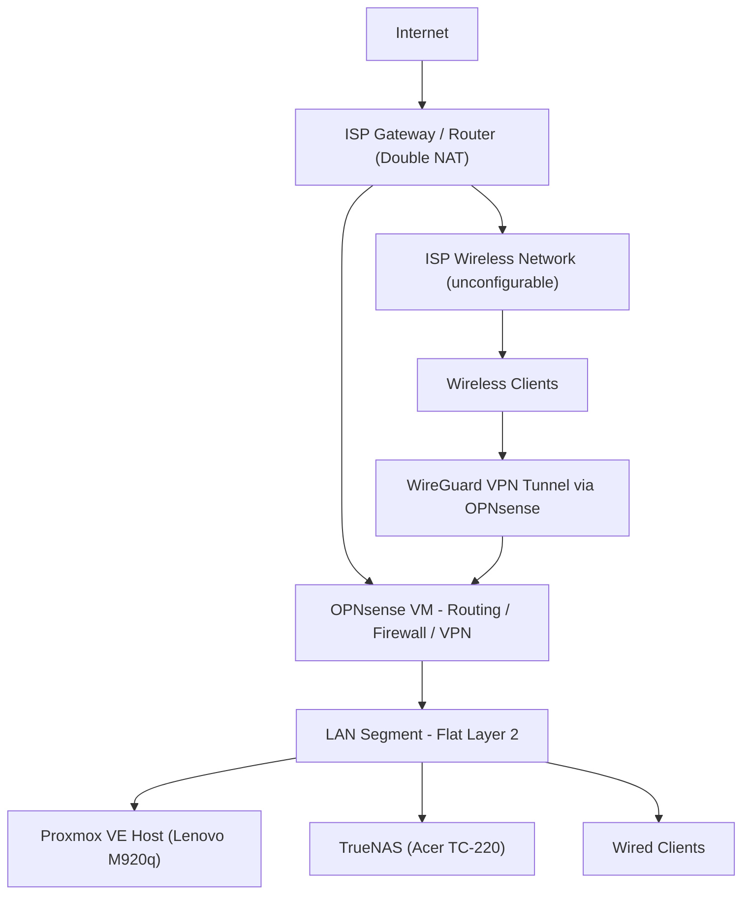

# Self Hosted Infrastructure Overview

## Introduction

This repository documents a modular homelab focused on networking, virtualization, storage, infrastructure and application experimentation. It includes architecture diagrams, configuration decisions, networking layouts, and operational documentation.

The environment is built around a set of core infrastructure components:
- A Proxmox VE virtualization host running on a Lenovo M920q
- An OPNsense virtual machine handling routing, firewalling, network segmentation, and other edge services
- A TrueNAS system (on an Acer TC-220) providing centralized storage via ZFS, and NFS/SMB shares with robust data integrity systems.

The primary purpose of this homelab is to provide a controlled environment for learning/demonstrating infrastructure concepts, testing new technologies, and hosting personal services. It is intentionally designed to be modular, allowing components to be reconfigured or expanded over time.

---

## Design Principles
* Prefer simplicity over over-engineering
* Separate compute and storage roles where possible
* Use virtualization to maximize hardware utilization
* Avoid exposing internal services directly to WAN
* Incrementally improve infrastructure over full redesigns

---

## Current Architecture

### High-Level Topology


#### Analysis
This network design is the result of dealing with several constraints. The homelab intentionally favors incremental improvements over a complete redesign. New components are introduced only when they solve an existing limitation rather than for the sake of complexity.

The first is a lack of a proper wireless access point (AP). The ISP's given router and AP are proprietary devices with an extreme lack of transparent options and capabilities which my homelab will rely on, leaving my own homelab without wireless capabilities. Wireless clients remain connected to the ISP-managed network, which is isolated from the homelab LAN. WireGuard provides authenticated access to internal services without exposing them directly to the Internet and also allows secure remote access when away from home.

The second issue is a lack of a managed switch. Without proper VLAN support, all trusted devices reside on a single Layer-2 broadcast domain. This simplifies the current deployment but limits network segmentation, prevents isolation of infrastructure and storage traffic, and reduces flexibility for future expansion.

This architecture prioritizes functionality within existing hardware constraints. These design decisions are temporary and will be revisited as networking hardware is upgraded.

## Hardware Inventory

### Compute/Edge Node

#### Node A: Lenovo M920q (Proxmox VE Host)

* CPU: Intel i5-8500T (6C/6T)
* RAM: 16GB DDR4
* Storage: 256GB SSD
* Network interfaces:
    * nic0: 1x GbE onboard NIC
    * nic1-nic4: 4x 2.5GbE PCIe NIC
* Role: virtualization host (PVE)

#### Node B: TC-220 (TrueNAS Node)

* CPU: AMD A10-7800 (4C/4T)
* RAM: 16GB DDR3
* Storage configuration:
    * 80GB SSD (Boot/OS Drive)
    * 512GB HDD (backup target pool)
    * 2TB HDD (tank ZFS pool)
* Network interfaces: 1GbE NIC
* Role: NAS / file server

#### Analysis

Both nodes are refurbished desktop computers with limited resources. This necessitates a specific seperation of roles for computation (CPU + RAM use), networking, and storage.

Node B (TC-220) is a full-size desktop with a case and motherboard that can support up to 4 SATA disk drives, and has far weaker computation capacity compared to Node A. Since the qualities of a NAS are more dependent on disk drive quantity, and less on CPU/RAM speed Node B is already optimized compare to Node A

Node A (M920q), being a small-form-factor PC, cannot fit multiple disk drives inside itself, and has much more capable computation performance compared to Node B. Serving as a host for an OPNsense VM on Proxmox VE, it was fitted with a quad-port 2.5GbE PCIe NIC expansion to serve that function, alongside general computation services.


---

## Virtualization Layer

### Node A (PVE)

* Proxmox VE Version: 9.2.3
* Storage backends:
    * `local` (local SSD)
    * `local-lvm` (lvm, local SSD)
* Network bridges:

  * `vmbr0` (LAN + OPNsense passthrough)

#### Analysis (Backup Integration)
Node A has no ZFS-backed storage; snapshot-capable backup modes (vzdump `Snapshot` mode) depend on guest disks residing on `local-lvm` (LVM-thin), which supports live snapshots. Guests provisioned on plain `local` storage cannot use Snapshot mode and require `Suspend` or `Stop` mode instead, or migration of their disk to `local-lvm`.

---

## Network Architecture

### OPNsense VM

Role: Edge firewall/router

#### Interfaces
| Interface       | Purpose                   |
| --------------- | ------------------------- |
| WAN             | Internet uplink           |
| LAN             | Primary trusted network   |
| Storage         | Dedicated storage network |
| Host            | Proxmox host management   |
| Internal Bridge | Virtual networking        |


#### OPNsense Services

* DHCP: Dnsmasq DHCP
* DNS resolver: Unbound DNS
* VPN: WireGuard 
* Dynamic DNS: os-ddclient (client plugin), DuckDNS (server/service)

#### Firewall Policy Summary

* Default deny inbound
* LAN -> WAN, Storage, allowed
* Storage -> WAN, LAN allowed
* WAN Allows for VPN
* Management -> WAN, LAN allowed

#### Analysis
This section's architecture is undergoing experimentation and is not considered final, specifically the connection between PVE host and OPNsense.

The decision to virtualize OPNsense is primarily informed by hardware constraints. With the few computers available, it is necessary to have Node A serve as both edge router and general application server, especially since Node B is already a dedicated storage appliance. An additional benefit to virtualizing OPNsense (as well as anything else) on Proxmox is ease of duplicaiton, backups, replication, and reversion of machine state. This improves recovery time by enabling rapid rollback in the event of misconfiguration.

Physical interfaces are directly set for WAN, LAN, and dedicated interfaces for NAS devices and the PVE host itself, VLAN use is restricted to virtual connections between PVE host and OPNsense as inventory stands. In future, all traffic of the host will be routed through PCIe passthrough for better performance and security (as well as reducing the amount of physical infrastructure).

Core infrastructure services, including DHCP, DNS, VPN, and Dynamic DNS, are consolidated on OPNsense to simplify configuration and management. This creates a single point of failure, but reflects the current scale of the homelab. This single point of failure is mitigated at the VM level via scheduled vzdump backups (see Backup Strategy), a validated restore path exists via restoring the OPNsense VM backup to a new VMID on isolated networking.

Multiple IP subnets are used to logically separate infrastructure, storage, and client services. DHCP, DNS, and firewall policies are configured to allow only the required communication between these networks.

DDNS is necessary to ensure that my services can consistently be reached, despite frequent WAN IP swapping.

Firewall policies follow a default-deny approach with explicit rules permitting only required traffic between networks. Stateful inspection minimizes the number of required rules by allowing established connections to return traffic automatically, keeping the rule set relatively small and easy to audit.


---

## Storage Architecture

### TrueNAS (Node B)

* ZFS pools:
    * `tank` - tb single disk (primary data)
    * `backup` - 1x 512GB single disk (backup target for VM/container backups and configuration exports)
* Datasets:
    ```
    tank
    ├── users
    │    ├── user1/
    │    ├── user2/

    backup
    ├── vm-backups/        (flat; Proxmox vzdump target for all VMs/LXCs)
    └── config/
        ├── host/           (Proxmox host config exports)
        └── service/        (per-service config exports, e.g. opnsense/)
    ```
* SMB shares:
  * Personal share(s) - tank/users/*
  * `config-backup` - backup/config (dedicated admin user, guest access disabled, access-based enumeration enabled)
* NFS shares:
  * `vm-backups` - backup/vm-backups (export restricted to Node A's IP, maproot user/group set to root/wheel)

#### Dataset Configuration: `backup` pool

| Dataset | Preset | Compression | Recordsize | atime | Quota | Notes |
| --- | --- | --- | --- | --- | --- | --- |
| `vm-backups` | Generic | lz4 | 1M | off | ~200GB | Flat structure (no per-VM subdatasets); retention managed via Proxmox backup job "keep" settings rather than ZFS |
| `config` | Generic | zstd-9 | 128K (default) | off | ~10GB | `host/` and `service/` are plain subdirectories, not sub-datasets |

Checksums left at default on both datasets, this is the primary corruption-detection mechanism given neither pool has vdev-level redundancy.

#### Analysis
Due to limited disk drives, redundancy via RAID is untenable for either pool. Since each pool consists of a single disk, the risk of permanent complete data loss exists unless backups/replication are implemented. Both `tank` and `backup` currently rely on ZFS checksums plus snapshots for corruption/mistake protection only. Neither protects against physical disk failure. Replication backup services with more disks remain a future goal for `tank`.

The `backup` pool is deliberately scoped to VM/container backups and small configuration exports rather than a full replica of `tank`. Since `tank` is expected to exceed 512GB over time, a full mirror of `tank` onto the spare disk is not feasible; user SMB shares (`tank/users/*`) are intentionally excluded from this backup target since client + share already provides a basic two-copy redundancy for that data.

Future datasets for backups, logs, media and application/service data are being considered.

Currently, personal user shares are the main use of the NAS. With the only additional feature besides Snapshots enabled is global ZTSD-3 compression.

While all user datasets are configured as SMB datasets in TrueNAS, only tank/users is shared. Access to personal datasets/directories is controlled through SMB Access Control Lists (ACL). While reducing the amount of shares was desired for easier maintainability, there exists a hard requirement to be able to track and restrict individual quotas for each individual user, which is not a native feature of SMB. Therefore, each user requires a manual setup with an individual dataset at the ZFS/block level, rather than setting up something like a "home network" scheme.

---

## Services

### Currently Running

| Service     | Host      | Description      |
| ----------- | --------- | ---------------  |
| OPNsense    | Node A    | Router/firewall  |
| TrueNAS     | Node B    | storage/backup   |

---

## Backup Strategy

### Current State

* TrueNAS snapshots:
    * `tank/users`: hourly, 1 month retention, recursive on all child datasets
    * `backup` pool (`vm-backups`, `config`): daily, 2 week retention
* VM/LXC backups (Proxmox vzdump):
    * Scheduled backup job configured under Datacenter -> Backup on Node A, targeting the `vm-backups` NFS storage (content type: Backup only (no disk images))
    * Selection mode: all guests (so new VMs/LXCs are covered automatically without editing the job)
    * Mode: Snapshot for guests on `local-lvm`; Suspend/Stop required for any guest still on plain `local`
    * Compression: zstd
    * Retention: bounded "keep" settings (rather than unlimited) to stay within the ~200GB quota, since vzdump produces full independent archives per run rather than deduplicated increments
    * Failure notifications configured (email/webhook) so a failed job doesn't go unnoticed
* OPNsense-specific backup:
    * No separate config.xml export/push pipeline is maintained at this time. The OPNsense VM's full configuration is already captured as part of its regular vzdump backup.
    * Restore path: restore the relevant vzdump backup to a new, unused VMID with networking detached/isolated, verify boot and configuration via console (and optionally an isolated management network), then discard the test VM. This has been identified as sufficient for current recovery needs; a lower-effort, faster-access standalone config.xml export was considered (NFS-mount push from OPNsense, or SCP pull via Proxmox) but deprioritized as redundant given the VM-level backup already covers this.
* External backup (offsite): None, out of scope for now
* Proxmox host configuration backup (`/etc/pve`, network config, etc.) to `backup/config/host/`: **not yet implemented** planned as a manual script + cron job, still outstanding
* TrueNAS's own configuration export to `backup/config/host/`: not yet implemented, low priority
* Cross-pollination (storing small critical config copies on the *other* physical machine, rather than only within Node B): identified as a future improvement, not yet implemented

#### Analysis
The current backup posture is a deliberate tiered approach given fixed hardware (no new spending, no offsite target): critical/replaceable-effort data (VM and container state) is protected via scheduled vzdump backups to a dedicated NFS target, while bulk user data (`tank/users`) is intentionally left out of this backup target and instead relies on existing client+share redundancy plus snapshots against accidental deletion.

This still leaves several known gaps, accepted as reasonable trade-offs for now:
* Both `tank` and `backup` are single, non-redundant disks. A physical failure of either is only survivable if the *other* pool happens to hold a relevant copy (e.g. `backup` surviving a `tank` failure preserves VM/container state, but not user share data)
* Everything remains on-site: there is no protection against fire, theft, or a simultaneous failure affecting both nodes at once
* Proxmox host-level configuration (as opposed to guest VM/LXC state) is not yet backed up anywhere
* OPNsense recovery depends on a full VM restore rather than a lightweight config-only restore; this was an explicit scope decision, accepted as covering the large majority of realistic failure scenarios (disk failure, bad update, misconfiguration) without the added complexity of a second automation pipeline

Future work will focus on implementing the outstanding Proxmox host-config backup script, and revisiting external/offsite backup and cross-pollination of critical configs once resources allow.

---

## Security Model

* Firewall policy approach (default deny, least privilege)
* Remote access method (VPN via OPNsense)
* Admin access restrictions
* Network segmentation strategy
* SMB ACLs

#### Analysis
The security model is based on a default-deny posture, where all network communication must be explicitly permitted through firewall rules.

Access to internal services is restricted to trusted networks, with remote access only available through a WireGuard VPN endpoint on OPNsense. This prevents direct exposure of internal services to the WAN interface.

The network is logically separated into subnets based on function (e.g., client, storage, and management networks). This provides basic segmentation at Layer 3, although further isolation using VLANs is planned once appropriate switching hardware is available.

Administrative access is restricted to authenticated users using SSH keys and local credentials where required. Network file access is controlled using SMB ACLs at the dataset level, enforcing per-user permissions on shared storage. The new `config-backup` SMB share follows the same model: a single dedicated admin user, guest access disabled, and access-based enumeration enabled so the share is not casually browsable by other accounts. The `vm-backups` NFS export is similarly scoped, restricted to Node A's IP only rather than the broader LAN.

Overall, the model enforces security through layered controls at the firewall, network, and application levels, with each layer assuming minimal trust in the others.

---

## Identity & Access

* User management method (local, with future use of SSO servers)
* SMB authentication model: local, NFSv4 permissions
* Admin access approach: 
    * Primary: ssh keys, VPN admin connection on trusted device
    * secondary/redundancy: local passwords


#### Analysis
User management is currently handled using local accounts on TrueNAS, with access restricted to SMB shares through per-user permissions. This provides basic isolation but does not yet implement centralized identity management across services.

On Proxmox, administrative access is separated from the root account by using a dedicated admin user, following standard Linux privilege separation practices. On TrueNAS, this separation is handled automatically during setup.

Administrative access is primarily performed via SSH key authentication over VPN-protected connections from trusted devices. Local password authentication is retained as a fallback mechanism to ensure recovery in cases where higher-level systems (such as VPN or identity services) are unavailable.

This reflects a layered access model where authentication exists at multiple levels (network, system, and service), with no single dependency required for emergency access.

A future goal is to introduce a centralized identity provider (e.g., Authentik or similar) to support unified authentication across services. This would enable features such as MFA and passkey-based authentication, while simplifying user lifecycle management. However, integration depends on platform compatibility; TrueNAS supports LDAP and Active Directory integration, while OIDC support varies by service.

---

## Maintenance

* Update cadence:
    * PVE: monthly, manual
    * TrueNAS: monthly, manual
    * OPNsense: nightly, automatic

---

## Future Expansion Ideas

* Additional Proxmox nodes (cluster)
* Proxmox Backup Server (PBS) (deduplicated, incremental-forever backups)
* Kubernetes / container platform
* Dedicated reverse proxy (e.g., Nginx Proxy Manager / Traefik)
* Home automation stack (Home Assistant)
* VLAN expansion (IoT isolation, guest network)
* 10GbE upgrade between nodes
* Auth/ID/SSO service (LDAP, AD, OCID)
* Monitoring/logging centralization services
* Centralized DBMS
* Proxmox host configuration backup script (manual scripting, outstanding)
* TrueNAS configuration export automation
* Cross-pollination of critical config backups between Node A and Node B
* Offsite/cloud backup target (explicitly deferred, local-only for now)

---

## Known Issues / Limitations

* M920q hardware constraints (RAM, PCIe lanes, etc.)
* Single point of failure (for both storage and compute), partially mitigated for VM/container state via scheduled vzdump backups to the `backup` pool, but both `tank` and `backup` remain single, non-redundant disks
* Network bottlenecks
* Backup gaps:
    * No offsite/external backup target (accepted trade-off: local-only, no additional spend)
    * Proxmox host-level configuration not yet backed up (planned, not yet implemented)
    * TrueNAS's own configuration export not yet automated (low priority)
    * No cross-pollination of critical config backups between physical machines yet
* Virtualization section: 
    * Current bridge configuration requires review.
    *  Connectivity between Proxmox and the OPNsense VM is functional but not fully understood.
    * Planned redesign to simplify bridge topology and improve predictability.


---