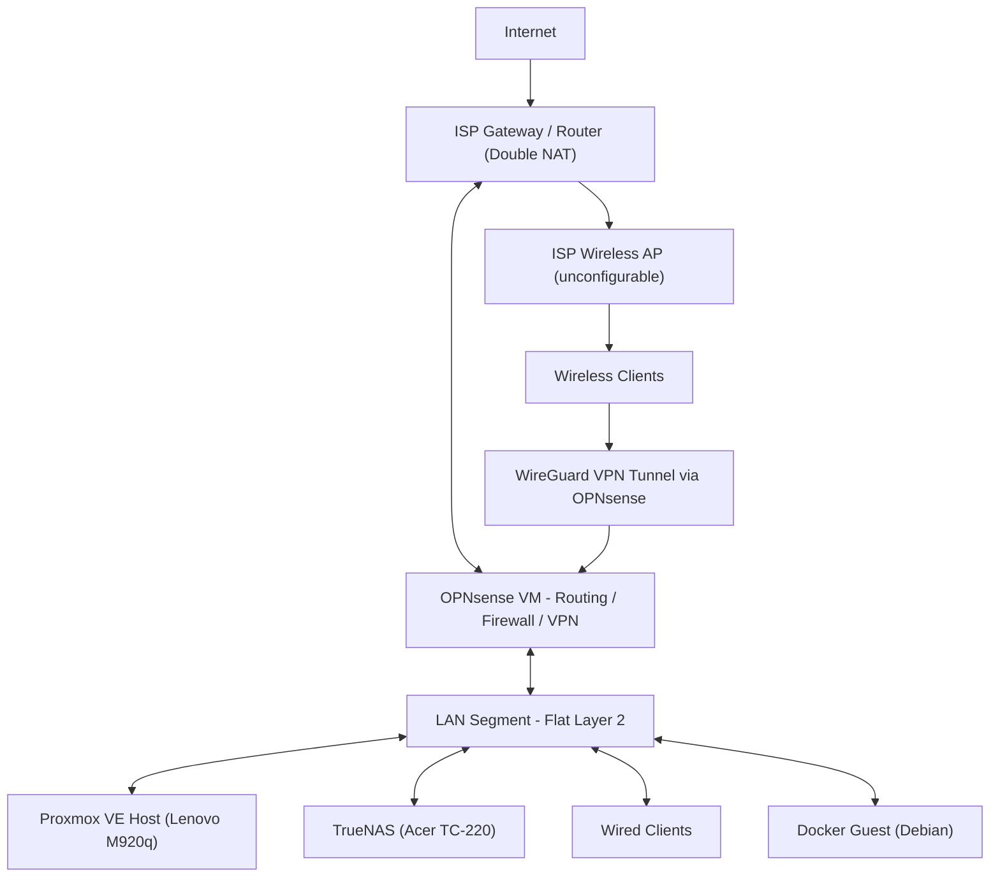

# Self Hosted Infrastructure Overview

## Introduction

This repository documents a modular homelab focused on networking, virtualization, storage, infrastructure and application experimentation. It includes architecture diagrams, configuration decisions, networking layouts, and operational documentation.

The environment is built around a set of core infrastructure components:
* A Proxmox VE virtualization host running on a Lenovo M920q
* An OPNsense virtual machine handling routing, firewalling, network segmentation, and other edge services
* A TrueNAS system (on an Acer TC-220) providing centralized storage via ZFS, and NFS/SMB shares with checksums, snapshots and integrity verification.
* A Docker App virtual machine handling database management, authentication/identity services, reverse proxies, monitoring and other apps.

The primary purpose of this homelab is to provide a controlled environment for learning/demonstrating systems administration concepts, testing new technologies, and hosting personal services. It is intentionally designed to be modular, allowing components to be reconfigured or expanded over time.

---

## Repo Architecture
 * `compose/` - Infrastructure as Code (IaC) in the form of compose files, env examples, and configurations. 

---

## Design Principles
* less is more, systems should exist for a reason
* Separate and isolate roles whenever possible (storage and edge should be seperate)
* Use virtualization to maximize hardware utilization
* Avoid exposing internal services directly to WAN
* Incrementally improve infrastructure over full redesigns

---

## Current Architecture

### High-Level Network Topology


```mermaid
graph TD
    Internet --> ISP["ISP Gateway / Router (Double NAT)"]

    ISP <--> OPNsense["OPNsense VM - Routing / Firewall / VPN"]

    OPNsense <--> LAN["LAN Segment - Flat Layer 2"]

    LAN <--> Proxmox["Proxmox VE Host (Lenovo M920q)"]
    LAN <--> TrueNAS["TrueNAS (Acer TC-220)"]
    LAN <--> WiredClients["Wired Clients"]

    LAN <--> Docker["Docker Guest (Debian)"]

    ISP --> WiFi["ISP Wireless AP (unconfigurable)"]
    WiFi --> WirelessClients["Wireless Clients"]

    WirelessClients --> VPN["WireGuard VPN Tunnel via OPNsense"]
    VPN --> OPNsense
```
#### Analysis
This network design is the result of dealing with several constraints.

The first is a split-network between wired and wireless clients. The ISP's given router and AP are proprietary devices with an extreme lack of transparent options and capabilities that my homelab could rely on, leaving my own homelab without wireless capabilities. Wireless clients remain connected to the ISP-managed network, which is isolated from the homelab LAN. WireGuard provides authenticated access to internal services without exposing them directly to the Internet and also allows secure remote access when away from home.

The second issue is a lack of a managed switch. Without proper VLAN support, all trusted devices reside on a single Layer-2 broadcast domain. This simplifies the current deployment but limits network segmentation, prevents isolation of infrastructure and storage traffic, and reduces flexibility for future expansion.

This architecture prioritizes functionality within existing hardware constraints. These design decisions are temporary and will be revisited as networking hardware is upgraded.

## Hardware Inventory

### Compute/Edge Node

#### Node A: Lenovo M920q (Proxmox VE Host)

* CPU: Intel i5-8500T (6C/6T)
* RAM: 16GB DDR4
* Storage: 256GB SSD
* Network interfaces:
    * 1x GbE onboard NIC
    * 4x 2.5GbE PCIe NIC (Intel I226-V), passed through directly to the OPNsense VM via PCIe passthrough
* Role: virtualization host (PVE)

#### Node B: TC-220 (TrueNAS Node)

* CPU: AMD A10-7800 (4C/4T)
* RAM: 16GB DDR3
* Storage configuration:
    * 80GB SSD (Boot/OS Drive)
    * 512GB HDD (backup target pool)
    * 2TB HDD (tank ZFS pool)
* Network interfaces: 1GbE NIC
* Role: NAS / file server

#### Analysis

Both nodes are refurbished desktop computers with limited resources. This necessitates a specific separation of roles for computation (CPU + RAM use), networking, and storage.

Node B (TC-220) is a full-size desktop with a case and motherboard that can support up to 4 SATA disk drives, and has far weaker computation capacity compared to Node A. For the expected workload of a storage appliance, Node B is more optimized compared to Node A.

Node A (M920q), being a small-form-factor PC, cannot fit multiple disk drives inside itself, and has much more capable computation performance compared to Node B. Serving as a host for an OPNsense VM on Proxmox VE, it was fitted with a quad-port 2.5GbE PCIe NIC expansion to serve that function, alongside general computation services.

Node A also hosts a second guest VM (the "Docker VM," see Application Layer) alongside OPNsense, reinforcing its role as the general-purpose compute node, with Node B remaining purely storage-focused.

---

## Virtualization Layer

### Node A (PVE)

* Proxmox VE Version: 9.2.3
* Storage backends:
    * `local` (local SSD)
    * `local-lvm` (lvm, local SSD)
* Network bridges:

  * `vmbr0` (LAN, used by the Docker VM and other non-passthrough guests)
  * OPNsense's WAN/LAN physical ports (Intel I226-V) are passed through directly via PCIe passthrough, bypassing `vmbr0` entirely for those interfaces

### Guest: OPNsense VM
* vCPU: 2
* RAM: 4GB
* Disk: 16GB
* Network: WAN/LAN via direct PCIe passthrough of the onboard Intel I226-V ports (see Hardware Inventory), not bridged through `vmbr0`


### Guest: Docker VM ("docker-host")

* Base OS: Debian 12 (netinst, minimal, no desktop environment)
* vCPU: 4
* RAM: 8GB
* Disk: 128GB
* Network: `vmbr0` (LAN), static DHCP reservation on OPNsense
* Container runtime: Docker CE (official upstream repo, not Debian-packaged), Compose plugin (`docker compose`, not standalone `docker-compose`)
* Guest agent: `qemu-guest-agent` installed and enabled for clean shutdown/IP reporting to Proxmox

#### Analysis
The Docker VM was deliberately built as a VM rather than an LXC container, despite Proxmox supporting nested Docker-in-LXC; cgroup/AppArmor interactions and inconsistent systemd support inside LXC make VMs the more predictable and widely-supported path for a Docker host, and preserve a clean failure boundary from OPNsense.

Data placement follows a deliberate split: the orchestration layer (`/opt/docker/<service>/`, containing compose files and small local config/state) stays on the VM's local disk, while only bulk, non-database data (media libraries, documents, photo originals) is bind-mounted from an NFS export on TrueNAS (`tank/appdata`). This avoids two known failure classes: Docker/Compose depending on a not-yet-mounted network share at boot, and NFS's weaker file-locking semantics causing corruption risk for anything with an embedded database.

**Secrets handling (Traefik `.env`, `acme.json`):** these currently remain local to the Docker VM's disk (`/opt/docker/traefik/`) rather than being relocated to an NFS-backed, TrueNAS-encrypted dataset. This was an explicit decision after evaluating the threat model: Node A's disk is unencrypted, but the realistic threat this would protect against (physical theft/extraction of the drive) already implies a scenario severe enough to also compromise Node B, at which point relocating two small secret files provides negligible additional protection relative to the operational cost (new hard dependency of Docker startup on TrueNAS/NFS availability, weaker guarantees around `acme.json`'s periodic rewrite-on-renewal under NFS locking). Lower-cost, higher-value mitigations were applied instead: restrictive file permissions (`chmod 600`), and moving the DuckDNS API token out of container environment variables (visible via `docker inspect`) into a Compose file-based secret. Token rotation remains available as a fast, low-cost response if compromise is ever suspected.

---

## Network Architecture

### OPNsense VM

Role: Edge firewall/router

#### Interfaces
| Interface       | Purpose                   |
| --------------- | ------------------------- |
| WAN             | Internet uplink           |
| LAN             | Primary trusted network   |
| Storage         | Dedicated storage network |
| Host            | Proxmox host management   |
| Internal Bridge | Virtual networking        |


#### OPNsense Services

* DHCP: Dnsmasq DHCP
* DNS resolver: Unbound DNS
* VPN: WireGuard 
* Dynamic DNS: os-ddclient (client plugin), DuckDNS (service)

#### Firewall Policy Summary

* Default deny inbound
* LAN -> WAN, Storage, allowed
* Storage -> WAN, LAN allowed
* WAN Allows for VPN
* Management -> WAN, LAN allowed

#### Analysis
This section's architecture is undergoing experimentation and is not considered final, specifically the connection between PVE host and OPNsense.

The decision to virtualize OPNsense is primarily informed by hardware constraints. With the few computers available, it is necessary to have Node A serve as both edge router and general application server, especially since Node B is already a dedicated storage appliance.

WAN and LAN are served by physical Intel I226-V ports passed through directly to OPNsense via PCIe passthrough, not bridged through the host; dedicated interfaces for NAS devices and the PVE host itself are handled separately, and VLAN use is restricted to virtual connections between PVE host and OPNsense as inventory stands.

Core infrastructure services, including DHCP, DNS, VPN, and Dynamic DNS, are consolidated on OPNsense to simplify configuration and management. This creates a single point of failure, but reflects the current scale of the homelab.

Multiple IP subnets are used to logically separate infrastructure, storage, and client services. DHCP, DNS, and firewall policies are configured to allow only the required communication between these networks.

DDNS is necessary to ensure that my services can consistently be reached, despite frequent WAN IP swapping.

Firewall policies follow a default-deny approach with explicit rules permitting only required traffic between networks. Stateful inspection minimizes the number of required rules by allowing established connections to return traffic automatically, keeping the rule set relatively small and easy to audit.


---

## Storage Architecture

### TrueNAS (Node B)

* ZFS pools:
    * `tank` - 2tb single disk (primary data)
    * `backup` - 1x 512GB single disk (backup target for VM/container backups and configuration exports)
* Datasets:
    ```
    tank
    └── data
    └── users
         ├── user1/
         └── user2/
    

    backup
    ├── config/
    │   ├── host/           (Proxmox host config exports)
    │   └── docker/        (per-service config exports, e.g. opnsense/)
    └── vm-backups/         (flat; Proxmox vzdump target for all VMs/LXCs)

    ```
* SMB shares:
  * Personal share(s) - tank/users/*
  * `config` - for storing backups of configurations and infrastructure-as-code
* NFS shares:
  * `data` - for storing data that appplications consume (images, media, documents, code, etc.)
  * `vm-backups` - for storing proxmox's backup data

#### Analysis
Due to limited, non-uniform-sized disk drives, redundancy via RAID is untenable for either pool. Since each pool consists of a single disk, the risk of permanent complete data loss exists unless backups/replication are implemented. Both `tank` and `backup` currently rely on ZFS checksums plus snapshots for corruption/mistake protection only; neither protects against physical disk failure.

The `backup` pool is deliberately scoped to VM/container backups and small configuration exports rather than a full replica of `tank`. Since `tank` is expected to exceed 512GB over time, a full mirror of `tank` onto the spare disk is not feasible; user SMB shares (`tank/users/*`) are intentionally excluded from this backup target since client + share already provides a basic two-copy redundancy for that data.

Currently, personal user shares are the main use of the NAS. With the only additional feature besides Snapshots enabled is global ZSTD-3 compression.

While all user datasets are configured as SMB datasets in TrueNAS, only tank/users is shared via SMB. Access to personal datasets/directories is controlled through SMB Access Control Lists (ACL). While reducing the amount of shares was desired for easier maintainability, there exists a hard requirement to be able to track and restrict individual quotas for each individual user, which is not a native feature of SMB. Therefore, each user requires a manual setup with an individual dataset at the ZFS/block level, rather than setting up something like a "home network" scheme.

---

## Services

### Currently Running

| Service     | Host              | Description      |
| ----------- | ----------------- | ---------------  |
| OPNsense    | Node A            | Router/firewall  |
| TrueNAS     | Node B            | storage/backup   |
| docker-host | Node A (guest VM) | Debian 12 + Docker CE, application/container host |
| Traefik     | docker-host        | Reverse proxy, TLS termination, DuckDNS DNS-01 wildcard cert (Let's Encrypt), Docker-label-driven routing |
| postgres     | docker-host        | centralized dbms |
| redis     | docker-host        | centralized redis storage |
| Authentik     | docker-host        | robust SSO Auth/ID server |
| monitoring-stack | docker-host | Loki, Promtail, Grafana, Prometheus, and exporters |
| Other Services     | any (docker preferred)       | Other services running that don't affect design decsions. Unless otherwise constrained, these should run on docker for ease of Creation/Deletion, availability of images and familiarity reasons. |


---

## Backup Strategy

### Current State

* TrueNAS snapshots:
    * `tank/users`: hourly, 1 month retention, recursive on all child datasets
    * `backup` pool (`vm-backups`, `config`): daily, 2 week retention; protects the backup target itself from an accidental overwrite or bad backup run clobbering the last good copy
* VM/LXC backups (Proxmox vzdump):
    * Scheduled backup job configured under Datacenter → Backup on Node A, targeting the `vm-backups` NFS storage (content type: Backup only (no disk images))
    * Selection mode: all guests except OPNsense (see OPNsense-specific backup below for the reason this guest is excluded)
    * Mode: Snapshot for guests on `local-lvm`; Suspend/Stop required for any guest still on plain `local`
    * Compression: zstd
    * Retention: bounded "keep" settings (rather than unlimited) to stay within the ~200GB quota, since vzdump produces full independent archives per run rather than deduplicated increments
    * Failure notifications configured (email/webhook) so a failed job doesn't go unnoticed
* OPNsense-specific backup:
    * Automated vzdump backups of this VM are disabled. Scheduled backup runs were found to reliably freeze LAN-side connectivity homelab-wide, recoverable only via a full power cycle of Node A; see Virtualization Layer (Guest: OPNsense VM) and Known Issues for the suspected cause.
    * Backup method: manual, encrypted `config.xml` export via OPNsense's System → Configuration → Backups page, performed whenever a meaningful rule/interface/service change is made, stored in `backup/config/service/opnsense/` via the `config-backup` SMB share
    * OPNsense's built-in in-GUI configuration history (auto-versioned on every change) serves as a secondary backstop between manual exports
    * Restore path: fresh OPNsense install, import the exported `config.xml`
* External backup (offsite): None, explicitly out of scope for now (local-only, budget issues)

#### Analysis
The current backup posture is a deliberate tiered approach given fixed hardware (no new spending, no offsite target): critical/replaceable-effort data (VM and container state) is protected via scheduled vzdump backups to a dedicated NFS target, while bulk user data (`tank/users`) is intentionally left out of this backup target and instead relies on existing client+share redundancy plus snapshots against accidental deletion.

OPNsense is excluded from automated vzdump jobs. The vzdump job interrupts the router's VM, which causes a network outage and a subsequent job failure. Instead of a VM backup, manual backups of the OPNsense configuration are performed whenever changes are made to the router configuration. This is considered acceptable since a well configured router should not change unless manually intervened and state data such as logs and graphs are to be offloaded to a dedicated monitoring stack.

Fortunately, in the event of OPNsense going down, a simple cable switch from the OPNsense router ports to the ISP router will re-establish networking for the household while restoration is in progress. 

This still leaves several known gaps, accepted as reasonable trade-offs for now:
* Both `tank` and `backup` are single, non-redundant disks; a physical failure of either is only survivable if the *other* pool happens to hold a relevant copy (e.g. `backup` surviving a `tank` failure preserves VM/container state, but not user share data)
* Everything remains on-site; there is no protection against fire, theft, or a simultaneous failure affecting both nodes at once
* Proxmox host-level configuration (as opposed to guest VM/LXC state) is not yet backed up anywhere
* OPNsense recovery depends on a configuration-only restore to a freshly installed VM rather than a full VM-state restore; this trades away OS-level recovery (installed packages, plugin versions, manual OS-level tweaks) in exchange for avoiding the backup-triggered network outage described above

---

## Security Model

* Firewall policy approach (default deny, least privilege)
* Remote access method (VPN via OPNsense)
* Admin access restrictions
* Network segmentation strategy
* SMB ACLs

#### Analysis
The security model is based on a default-deny posture, where all network communication must be explicitly permitted through firewall rules.

Access to internal services is restricted to trusted networks, with remote access only available through a WireGuard VPN endpoint on OPNsense. This prevents direct exposure of internal services to the WAN interface.

The network is logically separated into subnets based on function (e.g., client, storage, and management networks). This provides basic segmentation at Layer 3; further isolation using VLANs requires additional switching hardware not currently in place.

Administrative access is restricted to authenticated users using SSH keys and local credentials where required. Network file access is controlled using SMB ACLs at the dataset level, enforcing per-user permissions on shared storage. The new `config-backup` SMB share follows the same model: a single dedicated admin user, guest access disabled, and access-based enumeration enabled so the share is not casually browsable by other accounts. The `vm-backups` NFS export is similarly scoped, restricted to Node A's IP only rather than the broader LAN.

The most obvious problem might be the lack of encryption-at-rest that Node A has, since Node A assumes router duty, instant reboot and assumption of that duty is paramount. This tradeoff does make the homelab more vulnerable to physical theft. However, that threat is deemed as not very likely in my defined threat model.

Overall, the model enforces security through layered controls at the firewall, network, and application levels, with each layer assuming minimal trust in the others.

---

## Identity & Access

* Authentik SSO (OIDC preferred, LDAP and corporate account integration considered for experimentation)
* User management method (local)
* SMB authentication model: local, NFSv4 permissions
* Admin access approach: 
    * Primary: ssh keys, VPN admin connection on trusted device
    * secondary/redundancy: local passwords


#### Analysis
Many services will use Authentik SSO to onboard and manage access and users to most services. This move simplifies access management and setup of accounts greatly. This is ideal, as it reduces the amount of management and complexity in administering users, permisisons and user security concerns. Admin/root accounts will still have a local account for redundancy/emergency reasons.

The main method of utilizing Authentik is as forward-auth in conjuction with a reverse-proxy (traefik), with services being handed credentials by Authentik for account creation and login, including for services/pages that do not have any login capabilities. The reasoning behind this is for 

User-facing applications primarily authenticate through Authentik using OIDC where supported. Infrastructure services (Proxmox, TrueNAS, OPNsense, Docker host, PostgreSQL, Redis and Authentik itself) intentionally remain locally administered and do not depend on centralized identity for administration or emergencies.

Administrative access is separated from the root account by using a dedicated admin user, following standard Linux privilege separation practices. This practice is consistent on all Operating Systems in the homelab.

Administrative access is primarily performed via SSH key authentication over VPN-protected connections from trusted devices. Local password authentication is retained as a fallback mechanism to ensure recovery in cases where higher-level systems (such as VPN or identity services) are unavailable.

This separation ensures that loss of the identity provider cannot prevent recovery of the infrastructure hosting it.

Limitations among certain native clients for services such as Navidrome and Nextcloud make using SSO impossible. For example: Navidrome relies on its own api that is incapable of handing off authentication. Nextcloud's mobile app technically allows for browser handoff but is extremely unreliable and unpredictable when returning from the browser to the app. These services must use local accounts, without any use from authentik.

---

## Application Layer

### Docker VM ("docker-host")

See Virtualization Layer for guest specs. Directory convention:

```
/opt/docker/      
├── <service>/
│   ├── compose.yml
│   └── data/               
...
```

Host Access: SSH, key-based only (Ed25519), password auth and root login disabled at `sshd_config` level.

---

## Maintenance

* Update cadence:
    * PVE: monthly, manual
    * TrueNAS: monthly, manual
    * OPNsense: nightly, automatic
    * Docker Guest: when necessary, manual

---

## Future Expansion Ideas

* Additional Proxmox nodes (cluster)
* Proxmox Backup Server (PBS) (deduplicated, incremental-forever backups)
* Kubernetes / container platform
* Home automation stack (Home Assistant)
* VLAN expansion (IoT isolation, guest network)
* 10GbE upgrade between nodes
* Proxmox host configuration backup script (manual scripting)
* TrueNAS configuration export automation
* Cross-pollination of critical config backups between Node A and Node B
* Offsite/cloud backup target (explicitly deferred, local-only for now)
* Replication/redundancy for `tank` (currently single, non-redundant disk)
* Bridge topology redesign on Node A for simpler, more predictable Proxmox/OPNsense connectivity
* design and implement a backup scheme for the application layer. 
* Setting up MFA with Authentik.

---

## Known Issues / Limitations

* M920q hardware constraints (RAM, PCIe lanes, etc.)
* Single point of failure (for both storage and compute); partially mitigated for VM/container state via scheduled vzdump backups to the `backup` pool, but both `tank` and `backup` remain single, non-redundant disks
* Network bottlenecks
* Backup gaps:
    * No offsite/external backup target (accepted trade-off: local-only, no additional spend)
    * Proxmox host-level configuration not yet backed up
    * TrueNAS's own configuration export not yet automated (low priority)
    * No cross-pollination of critical config backups between physical machines yet
* Virtualization section: 
    * Current bridge configuration requires review.
    * Connectivity between Proxmox and the OPNsense VM is functional but not ideal, requiring a physical connection between the PVE host port and a port controlled by OPNsense guest. Ideally, all proxmox host connections would go through a virtual bridge into the OPNsense guest, without the need for a wire. This would help with speed and reduce physical wire clutter.
* Networking / hardware:
    * Automated OPNsense VM backups are intentionally disabled because testing showed that the backup operation causes a network-wide outage and prevents the backup from completing reliably.
* Application layer:
    * Traefik's `.env` (DuckDNS token) and `acme.json` (wildcard cert private key) remain on Node A's unencrypted local disk rather than an encrypted TrueNAS-backed export (accepted trade-off, see Application Layer analysis); mitigated via file permissions and removing the token from `docker inspect` visibility
    
---