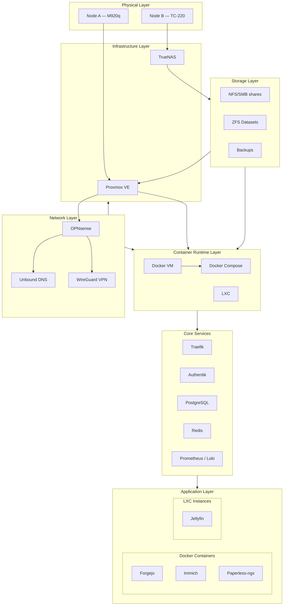
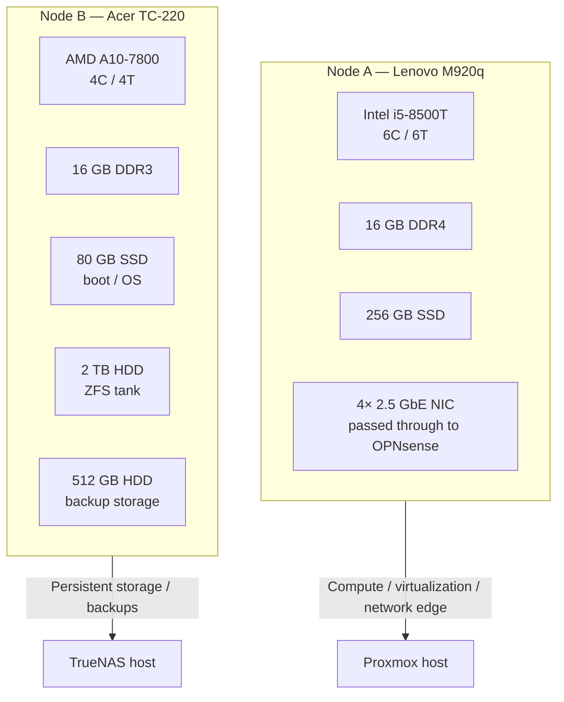
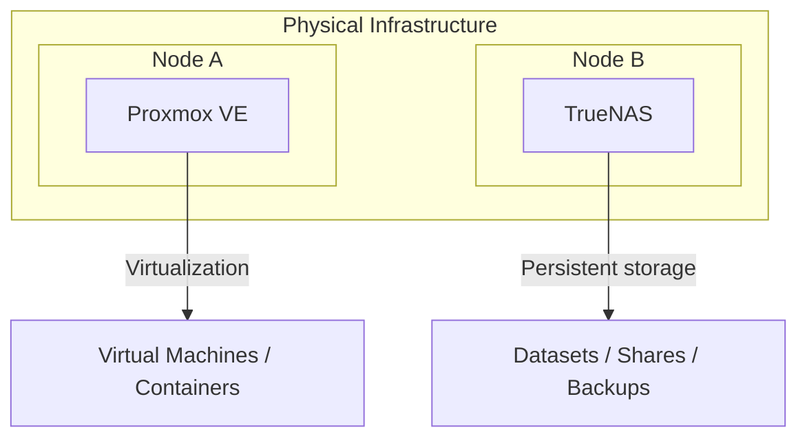
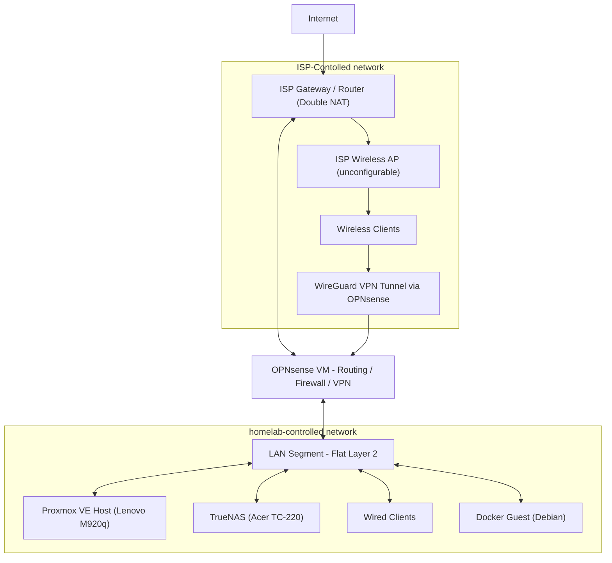
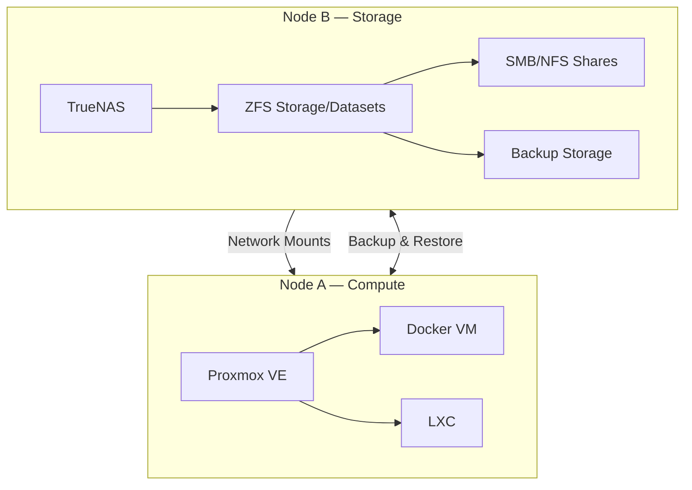
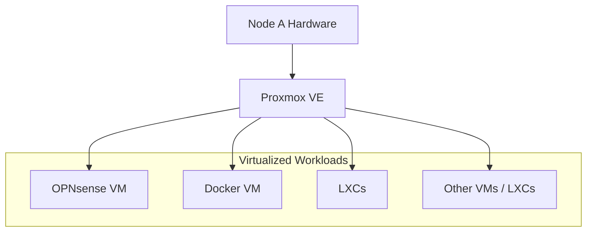
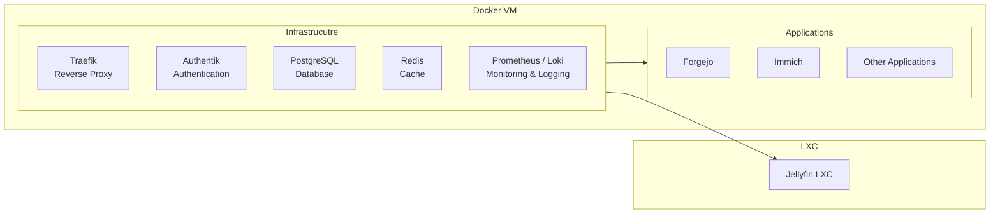

# Architecture

## Overview

This homelab is a small self-hosted infrastructure environment built around two physically separate nodes.

The architecture separates **compute and network infrastructure** from **persistent storage**:

* **Node A** provides compute, virtualization, and network-edge services.
* **Node B** provides persistent storage and backup storage.
* **Proxmox VE** provides the virtualization layer on Node A.
* **OPNsense** provides routing, firewalling, DNS, and VPN access.
* A dedicated **Docker VM** hosts application and infrastructure services.
* **TrueNAS** provides centralized storage through ZFS, NFS, and SMB.

The following diagrams describe the system from physical hardware through the network and storage layers to the applications running on top of them.

---

## Goals

The architecture is designed around several principles:

* Separate persistent storage from compute infrastructure.
* Centralize network routing and security.
* Isolate infrastructure roles where practical.
* Keep application workloads separate from the hypervisor.
* Minimize unnecessary external exposure.
* Make efficient use of limited hardware.
* Keep the architecture simple enough to understand and maintain.

---

# Complete Architecture

Arrows point from dependencies to dependent system.

The architecture follows a relatively simple progression:

**Hardware → Infrastructure → Network / Storage → Virtualization → Runtime → Applications**

Each layer provides the foundation for the layer above it while remaining as independent as practical.

The network stack is dependent on the infrastructure layer, but also is necessary for the infrastructure layer's connectivity.

The storage layer must be consumed by the PVE host due to unprivileged LXCs not being able to mount network shares. 

---

# Hardware

The physical infrastructure consists of two refurbished desktop systems with deliberately different roles.

Node A concentrates compute, virtualization, and network-edge functions because its compact form factor and relatively stronger CPU make it better suited to those workloads.

Node B is dedicated primarily to storage because its larger chassis and number of SATA ports provides substantially greater internal drive capacity.

Detailed hardware specifications are documented in [hardware.md](hardware.md)

---

# Infrastructure

The physical hardware provides two distinct infrastructure domains:

Node A provides the compute platform on which the network edge and application runtime operate.

Node B provides storage independently of the compute platform.

This separation means that storage does not need to be tied to the lifecycle of a particular virtual machine or application host.

---

# Network

OPNsense operates as the network edge of the homelab behind the ISP gateway. Arrows denote traffic within the homelab.

OPNsense provides:

* Routing
* Firewalling
* DHCP
* DNS through Unbound
* WireGuard VPN access
* Layer 3 network segmentation (VLANs)

The current physical network does not include a managed switch, so Layer 2 VLAN isolation is not currently available. Multiple IP subnets provide logical Layer 3 separation where required.

The ISP wireless network remains outside the homelab network.

Detailed addressing, firewall, DNS, and VPN configuration belongs in [`networking.md`](networking.md).

---

# Storage

Persistent storage is physically separated from the compute infrastructure. Arrows denote storage transfers.

TrueNAS provides the central persistent-storage layer through ZFS, SMB, and NFS.

The storage layer is independent of the Docker runtime. Applications may consume storage from TrueNAS without making the Docker VM itself the authoritative location of the underlying data.

This distinction separates:

* **Configuration** — version-controlled with Git
* **Application runtime/state** — maintained by the application environment
* **Persistent user data** — stored on TrueNAS where appropriate
* **Backups** — stored independently from the application runtime

Detailed datasets, shares, snapshots, and persistence boundaries belong in [`storage.md`](storage.md).

---

# Virtualization

Proxmox VE provides the virtualization layer on Node A. Arrows point from dependencies to dependent system.

OPNsense serves as the dedicated router, firewall and VPN for this infrastructure stack.

The Docker VM is the primary method of setting up the application layer.

Linux Containers (LXC) are used when a service requires capabilities that the Docker VM cannot satisfy. An example would be an application like Jellyfin, which requires GPU access.

Detailed VM, LXC, passthrough, and virtual-network configuration belongs in [`virtualization.md`](virtualization.md).

---

# Applications

Applications run primarily through Docker Compose inside the Docker VM. Arrows point from dependencies to dependent system.

The application layer is divided into two broad categories:

### Infrastructure Services

Shared services that provide capabilities to applications:

* **Traefik** — reverse proxy
* **Authentik** — authentication and SSO
* **PostgreSQL** — database infrastructure
* **Redis** — caching and transient application data
* **Prometheus / Loki** — monitoring and logging

These services are dependencies to other applications.

### Applications

All services that are not dependencies are under this category.

Applications should use the existing infrastructure where practical rather than introducing duplicate networking, authentication, database, or storage infrastructure for each service.

