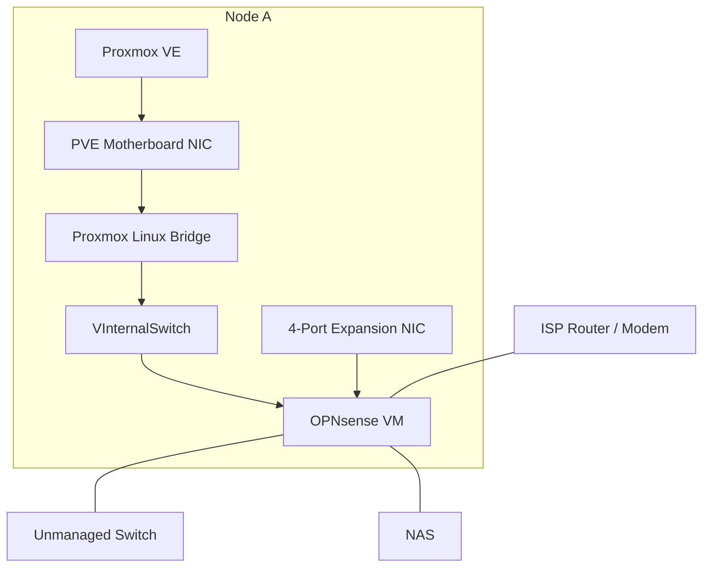
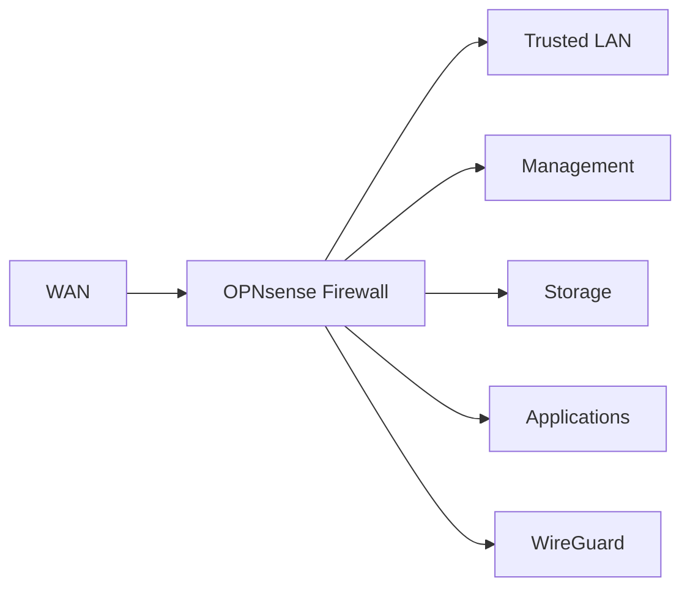
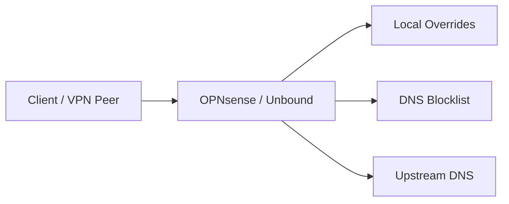

# Networking

## Overview

The network is managed by an OPNsense firewall/router running as a virtual machine on Node A's Proxmox VE host.

The network is segmented into separate logical networks for general clients, storage, management, and applications. OPNsense provides routing, firewalling, DHCP, DNS, VPN access, and dynamic DNS services for the internal network.

The current architecture is constrained by the fact that OPNsense is itself virtualized on the primary Proxmox node. A dedicated physical connection between the host and OPNsense provides the host with a path for remote administration.



The diagram represents the physical and virtual relationships rather than the exact physical port numbering.

---

## Network Architecture

OPNsense presents the following logical interfaces:

| Interface           | Purpose                       | Connectivity                           |
| ------------------- | ----------------------------- | -------------------------------------- |
| **WAN**             | Upstream connectivity         | ISP router                             |
| **LAN**             | Trusted client network        | Unmanaged switch and connected clients |
| **Storage**         | Dedicated storage network     | NAS                                    |
| **Management**      | Infrastructure administration | Dedicated physical OPNsense NIC        |
| **Applications**    | Service/application network   | VLAN over `VInternalSwitch`            |
| **VInternalSwitch** | Virtual transport             | Proxmox Linux bridge to OPNsense       |

The first four interfaces are associated with physical networking, while the Applications network is carried through the virtual networking layer.

### Applications Network

The Applications network is implemented as a dedicated VLAN and subnet.

The VLAN and subnet numbering follows a deliberate convention in which the network identifier corresponds to the VLAN identifier. This makes the relationship between the logical network and its VLAN readily identifiable during administration.

Only the Applications VLAN is currently active. Additional VLAN definitions exist for networks such as the Trusted Network, Storage, and Management, where applicable.

---

## Physical and Virtual Networking

Node A has a single physical Ethernet interface used by Proxmox VE itself. This interface is connected to an OPNsense physical interface and is presented to the OPNsense VM through a Proxmox Linux bridge.

This creates a dependency between the hypervisor and the virtual router:


The arrangement allows OPNsense to provide routing and firewalling for the virtualized Applications network while remaining the network boundary for the rest of the environment.

The consequence is that Node A's primary network path depends on the OPNsense VM being operational. A separate physical connection is therefore maintained between the host and OPNsense's dedicated Management interface so that the host remains remotely administrable under normal network-stack failures.

This is a current architectural constraint rather than an intended high-availability design.

---

## Network Segmentation

The network is divided according to function rather than treating all internal devices as belonging to one flat LAN.

The major trust and function boundaries are:



### Trusted LAN

The LAN is currently treated as the trusted client network. Devices on this network are permitted unrestricted IPv4/IPv6 connectivity under the current firewall policy.

This network also provides the primary administrative environment.

### Management

The Management interface provides infrastructure administration and is backed by the fourth physical Ethernet port on the OPNsense expansion NIC.

Management traffic is permitted to reach the management network itself, Storage, and LAN, as well as other destinations according to the current firewall policy.

### Storage

Storage is a dedicated network connected directly to the NAS through an OPNsense physical interface.

The network is permitted to communicate with Management and has broader connectivity under the current firewall policy.

### Applications

Applications is a dedicated VLAN intended for services hosted within the virtualized environment.

The firewall permits Applications traffic to reach:

* other Applications hosts;
* LAN;
* Storage; and
* the Internet.

Internet access is constrained by preventing Applications traffic from directly reaching private address space outside the explicitly permitted internal networks.

This provides segmentation without attempting to isolate application services completely from the rest of the infrastructure.

---

## Firewall Policy

OPNsense provides inter-network routing and enforces access between the network segments.

The firewall policy is based primarily on **interface and network trust boundaries** rather than individual service ports.

The broad policy is:

| Source       | Permitted destinations                                     |
| ------------ | ---------------------------------------------------------- |
| LAN          | Unrestricted                                               |
| Management   | Management, Storage, LAN, and other permitted destinations |
| Storage      | Management and other permitted destinations                |
| Applications | Applications, LAN, Storage, and Internet                   |
| WireGuard    | Internal resources according to VPN policy                 |
| WAN          | WireGuard ingress only                                     |

Firewall rules are evaluated as inbound traffic on the interface where the traffic enters OPNsense.

The Applications policy is particularly important because it permits useful communication with internal infrastructure while preventing unrestricted access to arbitrary private networks.

---

## NAT

The primary explicit outbound NAT rule provides Internet access to WireGuard clients.

```text
Source:      WireGuard network
Destination: Any
Translation: WAN interface address
Static Port: Disabled
```

This allows VPN clients to use the OPNsense WAN connection for Internet access while retaining the same firewall boundary as other internal traffic.

---

## VPN

WireGuard is hosted directly on OPNsense and provides remote access to the internal network.

Each peer is individually provisioned with its own cryptographic identity and VPN address.

VPN clients are permitted to access internal resources according to the WireGuard firewall policy. The VPN is therefore treated as another controlled network interface rather than as a trusted bypass around the firewall.

The WAN firewall exposes only the WireGuard UDP service required for VPN establishment.

---

## DHCP

DHCP is provided by Dnsmasq on OPNsense.

DHCP is currently enabled for:

* LAN
* Applications
* Storage.

Infrastructure systems and other devices requiring predictable addressing use DHCP reservations rather than relying on manually configured addresses wherever practical.

This centralizes address assignment and allows device addressing to remain manageable from OPNsense.

---

## Dynamic DNS

The WAN connection uses a dynamically assigned public address.

OPNsense updates a DuckDNS record through its dynamic DNS functionality so that the external endpoint remains discoverable despite changes to the ISP-assigned address.

The dynamic DNS name is also used as part of the internal DNS configuration.

---

## DNS

Unbound provides centralized DNS resolution for internal clients and WireGuard peers.

The general resolution path is:



Unbound provides:

* local DNS caching;
* internal DNS overrides;
* DNS filtering;
* DNS-over-TLS upstream resolution; and
* a common DNS service for both local and VPN clients.

### Internal DNS Overrides

The environment's DuckDNS domain is overridden internally so that services resolve to the internal reverse-proxy endpoint rather than requiring clients to traverse the external network path.

This allows the same service names to be used from inside and outside the network while keeping internal traffic inside the local network.

### DNS Filtering

DNS requests are filtered using the StevenBlack hosts-based blocklist.

Filtering at the network DNS layer provides a centralized policy that applies to clients using OPNsense for DNS resolution.

### Upstream Resolution

Unbound currently forwards DNS queries to external resolvers using DNS-over-TLS.

This encrypts the connection between the OPNsense resolver and its upstream DNS providers while retaining local caching, overrides, and filtering.

Unbound can alternatively perform recursive DNS resolution itself rather than forwarding queries to a third-party recursive resolver. The current configuration uses encrypted upstream forwarding instead.

---

## Design Considerations

### Virtualized Network Boundary

Running the network gateway as a VM provides considerable flexibility but introduces a dependency between networking and virtualization.

The current architecture effectively places the router inside the system that depends on the router for network connectivity. The dedicated Management path mitigates the resulting administration problem, but does not provide true independent network availability.

A future hardware revision could separate the network boundary from the general-purpose virtualization host, allowing OPNsense to operate independently of the application and virtualization stack.

### Segmentation vs. Isolation

The network is segmented according to function, but the segments are not uniformly isolated.

For example, Applications can reach selected trusted networks and Storage can communicate with Management. These relationships are intentional and reflect the services that need to communicate across boundaries.

The firewall therefore acts primarily as a mechanism for **controlling trust relationships**, rather than simply preventing all inter-network communication.

### Addressing Convention

Internal networks use private Class A address space and follow a VLAN-correlated numbering convention.

The actual addresses, DHCP ranges, VPN peer addresses, host addresses, and other operational network details are intentionally omitted from this public documentation. The important architectural property is the relationship between network function, VLAN, and addressing scheme rather than the specific values.
